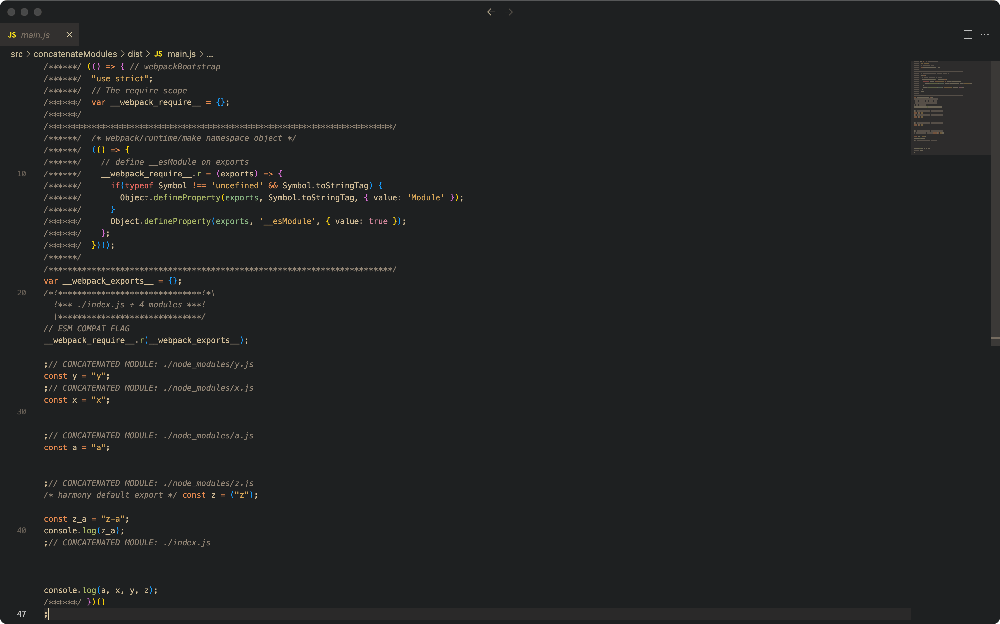
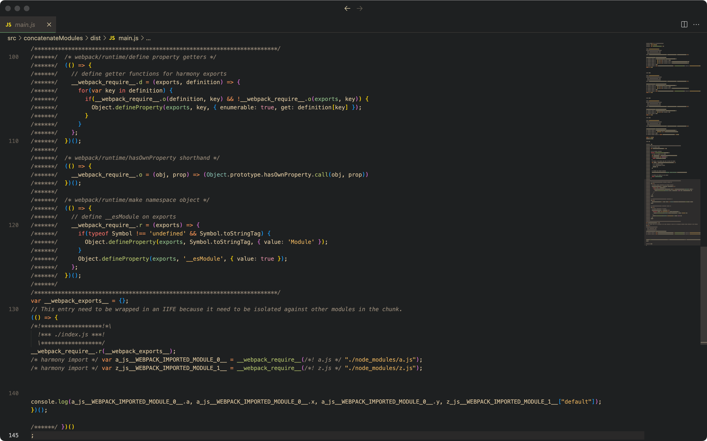

关闭 concatenateModules，导入的文件，一个文件是一个函数，引用时，再通过运行时代码调用，并连接起来，代码量大。

打开 concatenateModules，导入的文件会被合并在一个函数中，不同文件里，如果有相同命名的变量，会以文件名作为前缀防止重名，最终代码量减小。

下面的图片作为对比，50 和 150 行的差别：

<table>
	<tr>
		<td></td>
		<td></td>
	</tr>
</table>

生效 concatenateModules 是有限制的，[查看限制](https://webpack.js.org/plugins/module-concatenation-plugin/#optimization-bailouts)。配置项 concatenateModules 使用插件 ModuleConcatenationPlugin 插件触发 emit 阶段的 optimizeChunkModules 钩子。

相关链接：
- [optimization.concatenateModules](https://www.webpackjs.com/configuration/optimization/#optimizationconcatenatemodules)